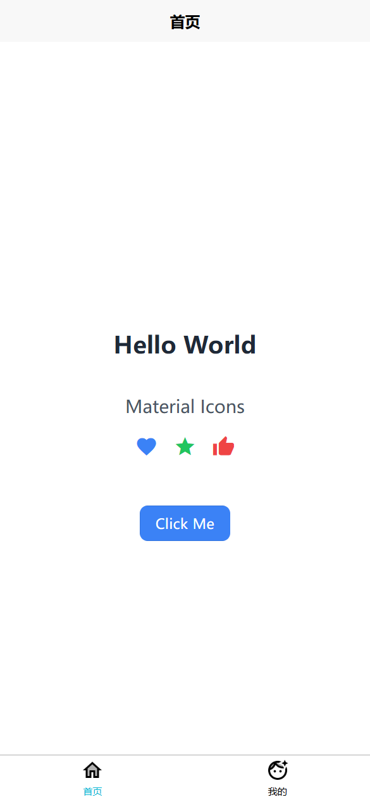

# Uniapp 项目模板技术栈说明

## 项目简介
一个基于 Vue3 + Vite + TypeScript 的 Uniapp 基础模板，集成了 TailwindCSS、uni-ui、Pinia、Sass、uView Plus 、Google Material Design 图标库等技术栈

## 项目截图

参考:
https://github.com/hy353/uniapp-vue3-vite-tailwindcss

非前端专业人士，本项目仅供参考学习，不提供任何技术支持和维护，使用风险自负。

##  安装依赖
- npm install

## 开发环境运行
- npm run dev # H5 开发环境
- npm run dev:mp-weixin # 微信小程序开发环境
- npm run dev:app # App 开发环境

## 核心框架
- Uniapp: 使用 Vue.js 开发跨平台应用的前端框架
- Vue.js: 渐进式 JavaScript 框架
- Vuex: 状态管理工具
- Vue Router: 路由管理

## UI 组件库
- uView UI: 多平台快速开发的 UI 框架
- uni-ui: Uniapp 官方组件库

## 开发工具
- HBuilderX: 官方推荐的 IDE
- Vue Devtools: Vue 调试工具

## 构建工具
- webpack: 模块打包工具
- npm/yarn: 包管理工具

## 跨平台支持
- 支持编译到：H5、微信小程序、App、快应用等平台

## 项目特性
- 支持 TypeScript
- 支持 Sass/SCSS
- 支持 Vue 单文件组件
- 支持条件编译
- 支持分包加载

## 开发规范
- ESLint: 代码规范检查
- Prettier: 代码格式化
- Git: 版本控制

## 其他工具
- Axios: HTTP 请求库
- dayjs: 日期处理库
- lodash: JavaScript 工具库

## 图标库
- uniapp-icons: Uniapp 官方图标库
- uView Plus Icons: uView Plus 内置图标库
- Material Icons: Google Material Design 图标库
- 支持自定义图标字体
- 支持 SVG 图标